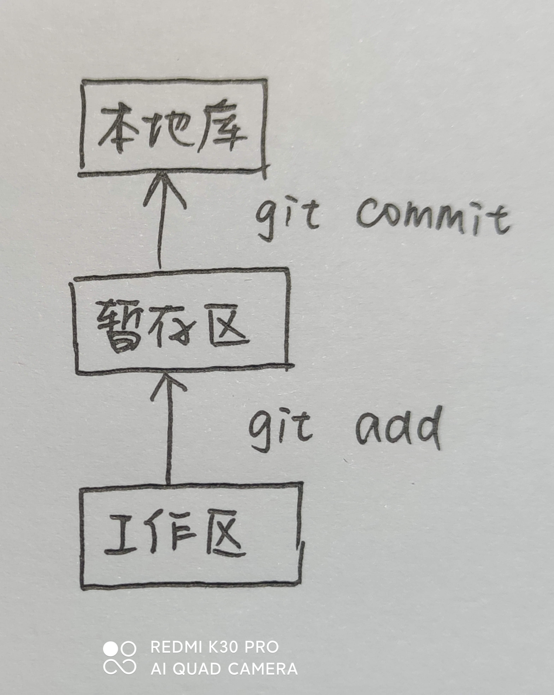

# git使用

## 一.工作方式




## 二.常用命令

### 1.本地库操作

```
初始化:git init
签名:git config --global user.name xxx
	git config --global user.email xxx
查看暂存区状态:git status
提交到缓存区:git add <fileName>
提交到本地库:git commit -m "<commit message>" <fileName>
查看历史记录:git log
			git log --pretty=oneline
			git log --oneline
更新版本:git reset --hard <hash>
		git reset --hard HEAD^
		git reset --hard HEAD~n
比较文件: git diff <fileName>(与缓存区比较)
		git diff HEAD <fileName>(与本地库某条历史记录比较)
查看分支:git branch -v
切换分支:git checkout <branchName>
创建分支:git branch <branchName>
合并分支:git merge <branchName>(把目的分支合并到当前分支)
```

a.关于add与commit:	add追踪文件,当文件进行修改之后可以不用再次add直接commit

b.关于合并冲突:	当多个分支对同一行内容进行不同修改时合并会产生冲突,进入冲突状态,用vim手动解决冲突后git add <fileName>然后git commit -m "xxx"(此处不需要文件名)提交即可

### 2. 远程库操作

```
ssh密钥生成:ssh-keygen -t rsa -C "2388909729@qq.com"
查看远程库别名:git remote -v
新建远程库别名:git remote add <name> <address>
重命名远程库别名:git remotr rename <oldName> <newName>
推送至远程库:git push <repName> <branchName>
克隆远程库到本地库:git clone <repName>(远程库下载,本地库初始化,origin别)
远程库下载:git pull <repName> <branchName>(pull=fetch+merge)
		git fetch <repName> <branchName>
		git merge <repName>/<branchName>
		
```

## 三.其他

### 1.关于删除操作

