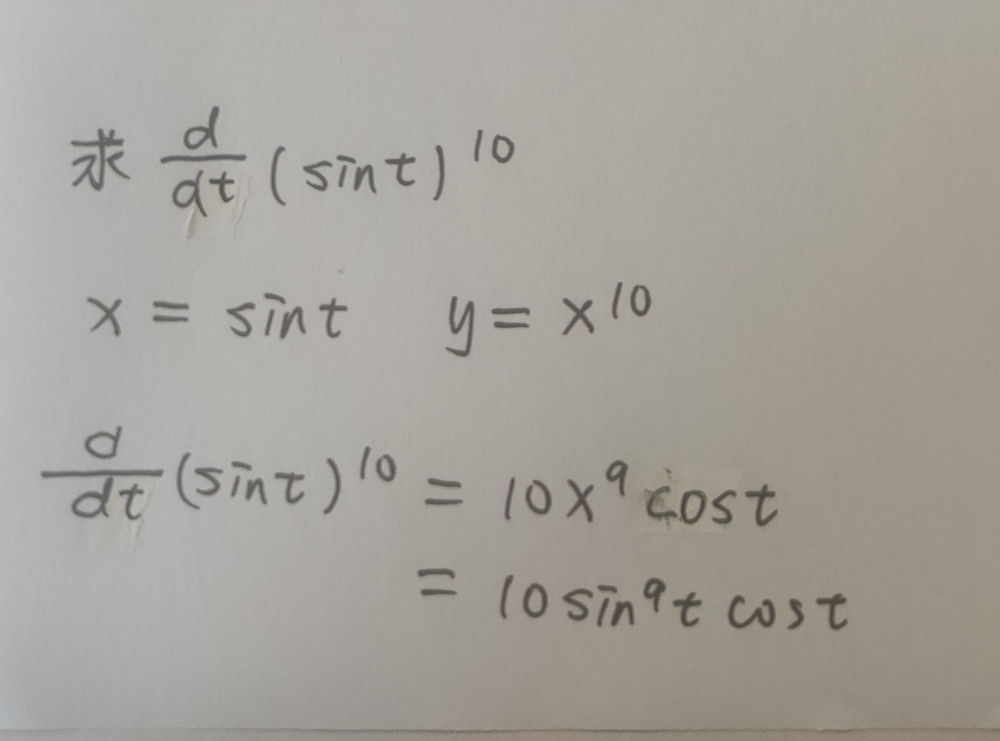

# 111 导数引入

## 一.由几何解释引入导数

由切线到导数：

* EX

  
  
  

---

## * 二项式定理

---

* EX

  

导数可以看作是函数的变化率

## 二.极限与连续性

左右极限与极限：

函数连续性判断：

函数不连续的几种情况：

连续性与可导性：

## 三.导数常用公式

常见公式：

补充：

lnx	1/x

---

## *三角函数

定义：

常用关系：

和差：

积与和差转换：

其他：

---

* EX

两个几何证明可以看看拓宽思路加深印象

* EX

  

## 四.隐函数求导

* EX

  

隐函数求导与常规求导比较：

反函数：

* EX

  

## 五.链式法则

由一道易错题引入:

链式法则-复合函数求导:

* EX

一些常用符号:

## 六.指数与对数

对于如下例子:

引入对数与e:

解决开始的例子:

* EX

ln在求导数与极限中的利用:

