# 113积分

## 一.不定积分

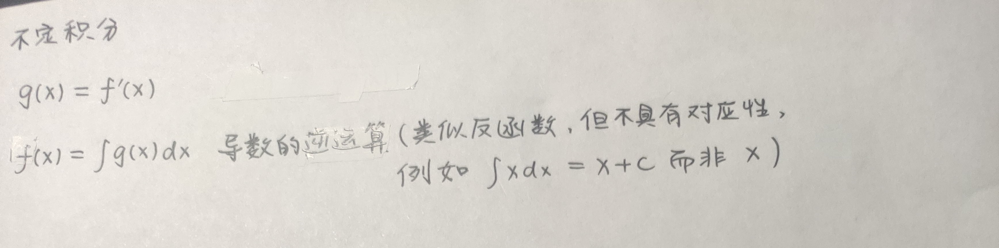

## 二.常用不定积分

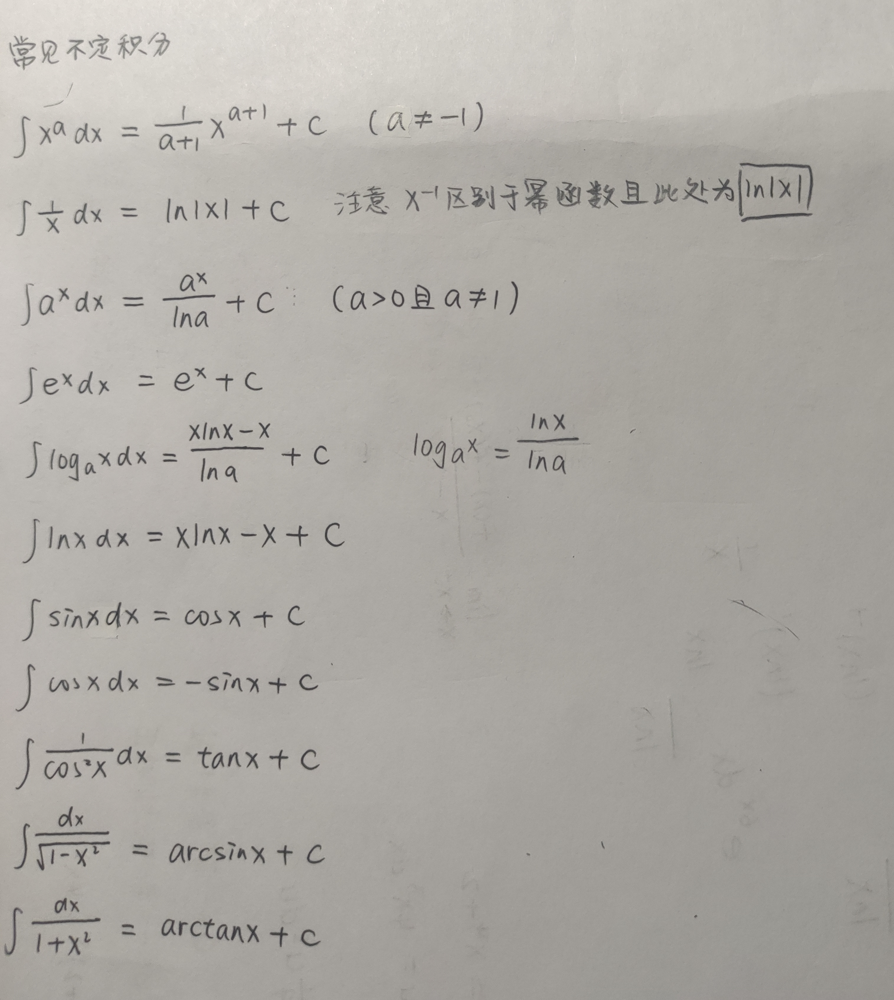

* EX

  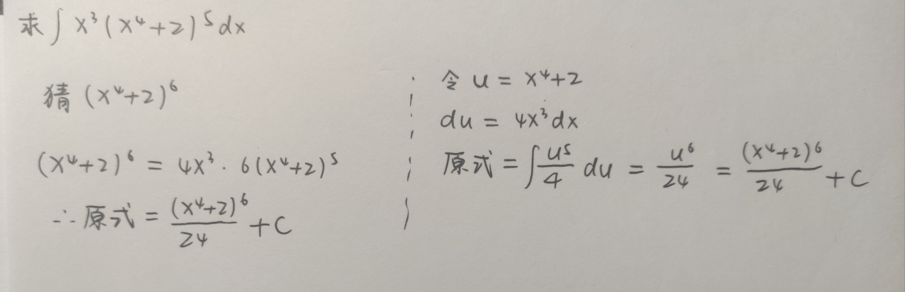

  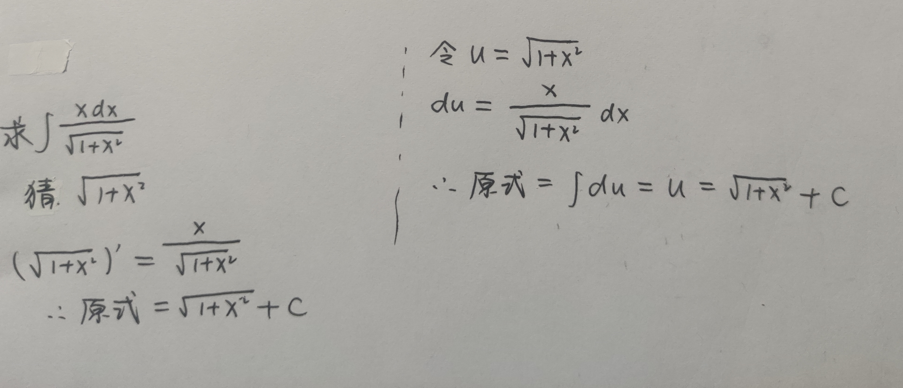

* EX

  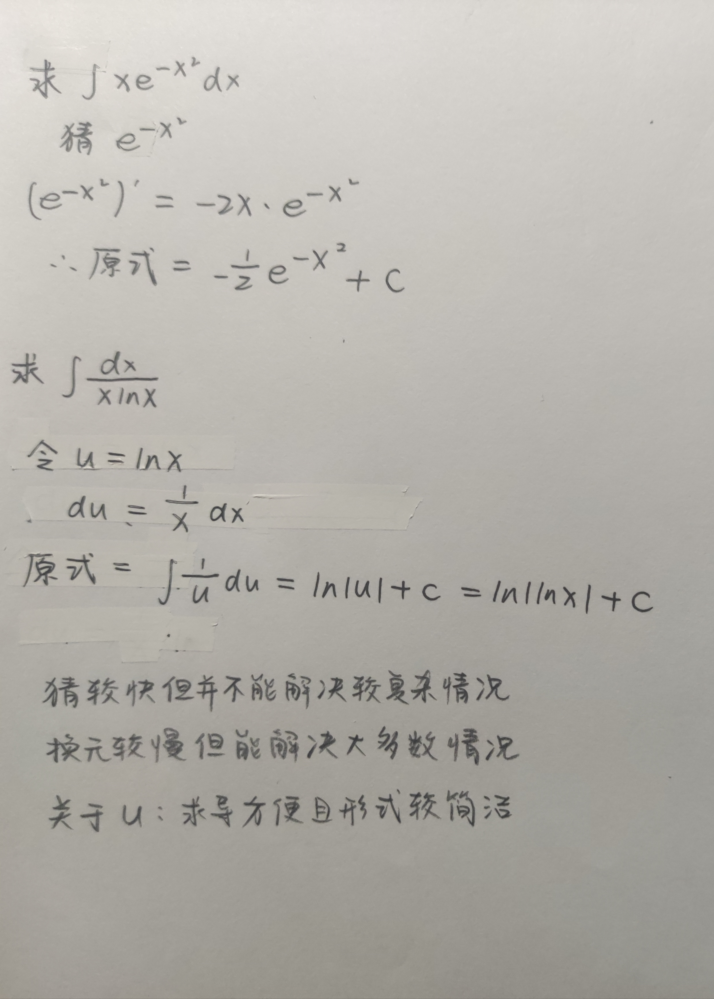

## 三.微分方程

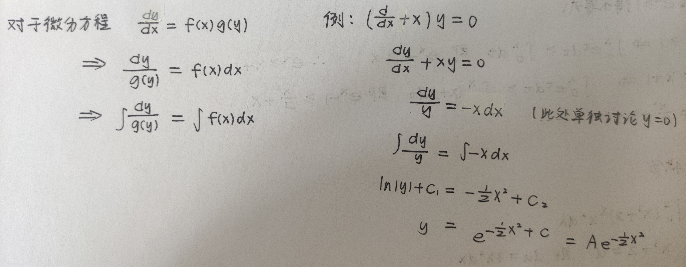

## 四.定积分与黎曼和

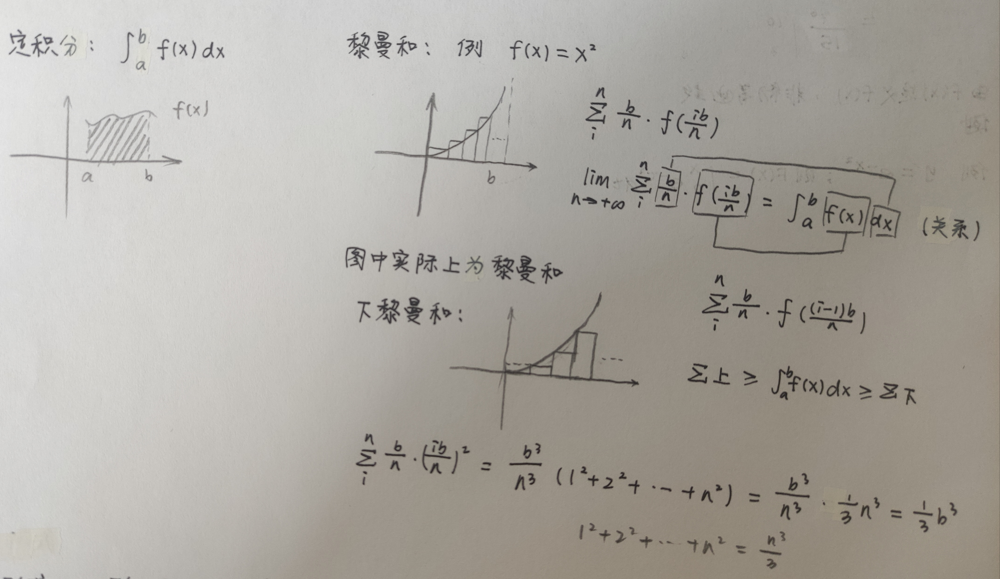

## 五.微积分基本定理

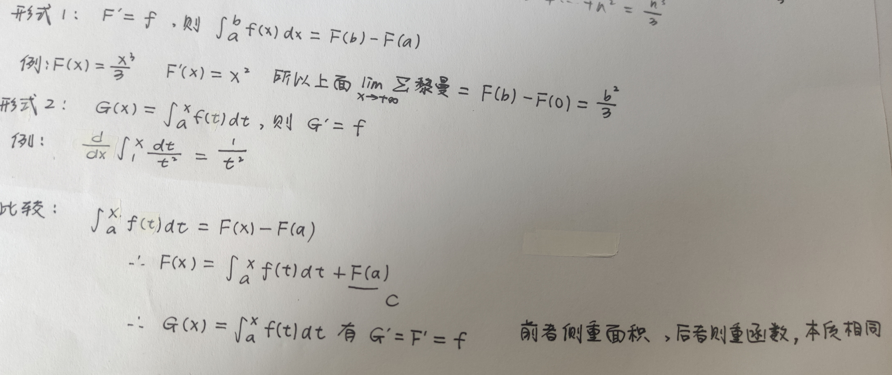

接下来举几个微积分基本定理使用的例子

* EX 求不等式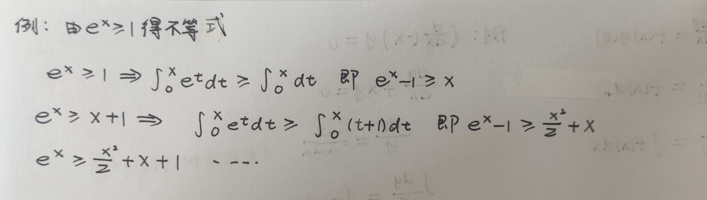

* EX 结合换元法求定积分

  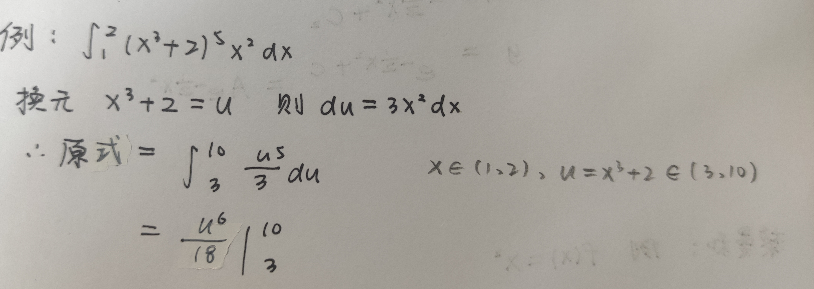

  

* EX 由微积分基本定理定义函数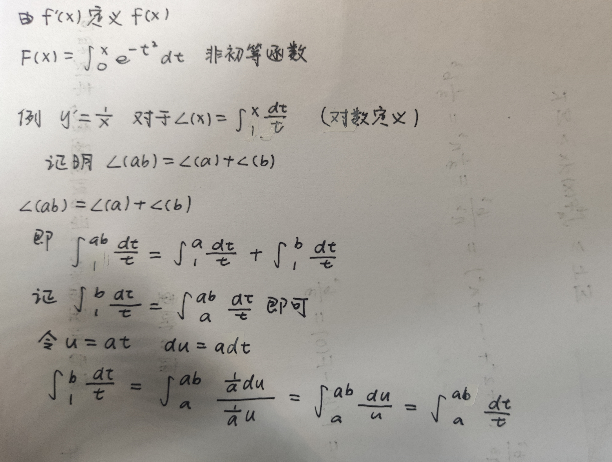

## 六.求面积,体积

面积:

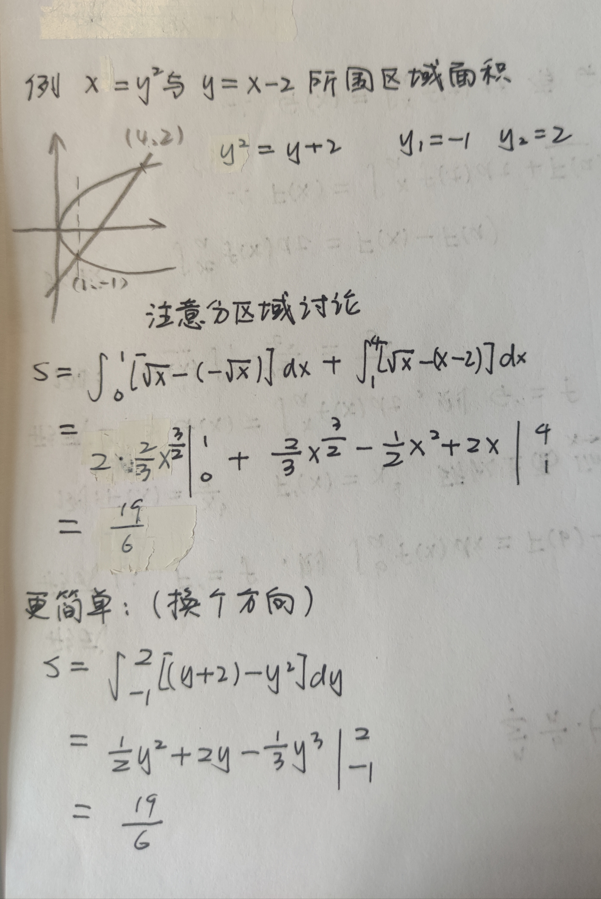

体积:

圆盘法和外壳法

* EX 圆盘法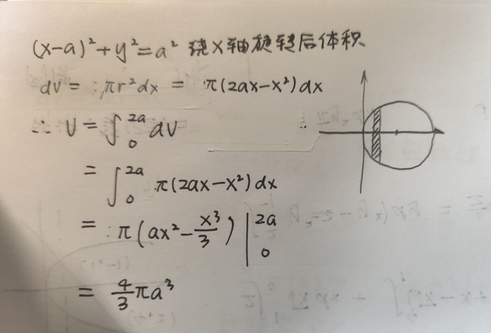
* EX 圆壳法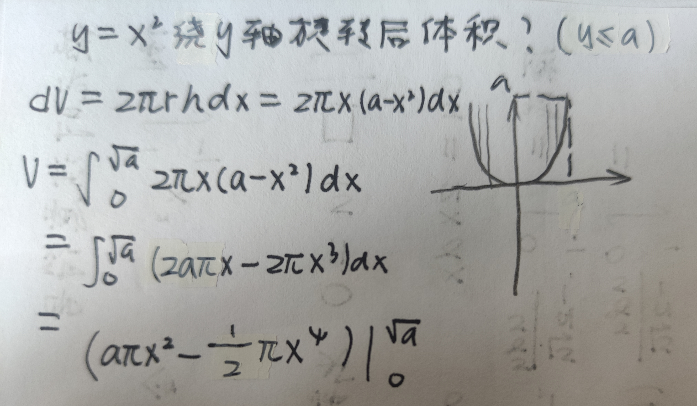

.
