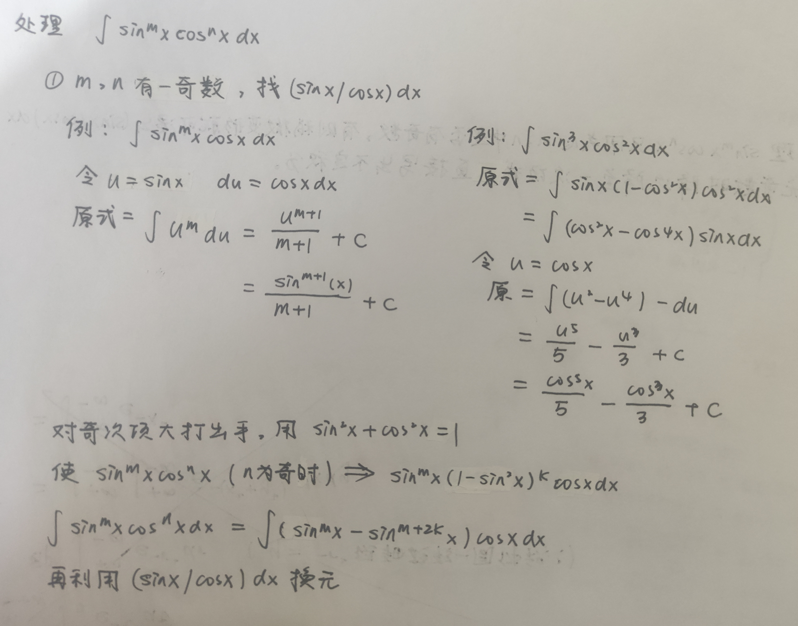
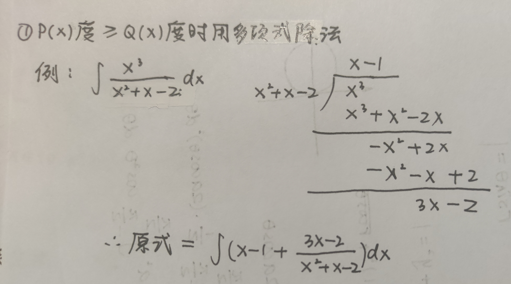

# 114其他

## 一.求平均值和概率

* 平均值:

* 加权平均:

* 概率:

* EX

  

## 二.黎曼和,梯形和,辛普森法则

## 三.一个常见极限

## 四.三角换元

* 关于sin,cos,tan,sec常见形式的不定积分处理

sin与cos:

总结思路如下

tan与sec:

* EX

  

* 三角换元

* EX

  

## 五.多项式分式不定积分

* EX

## 六.分部积分

* EX

  
  
* EX

  

* EX

  

## 七.弧长与表面积

* EX

  

## 八.参数方程与极坐标

## 九.洛必达

## 十.无穷积分

无穷级数敛散性判定

比较判别法

## 十一.无穷级数

## 十二.泰勒展开,麦克劳林展开

