# 212导数

## 定义类

### 导数定义式

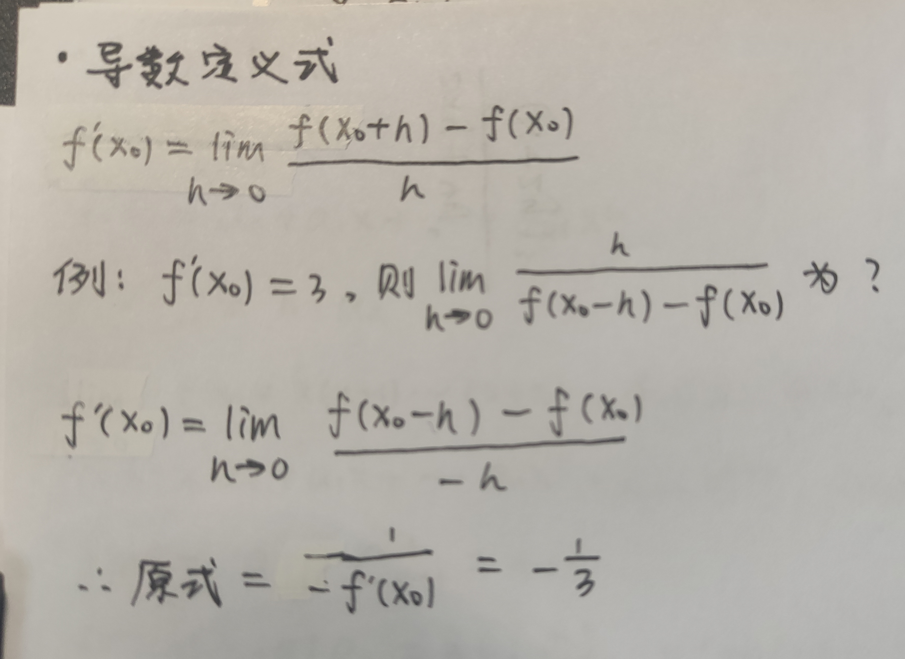

### 连续，可导，可微

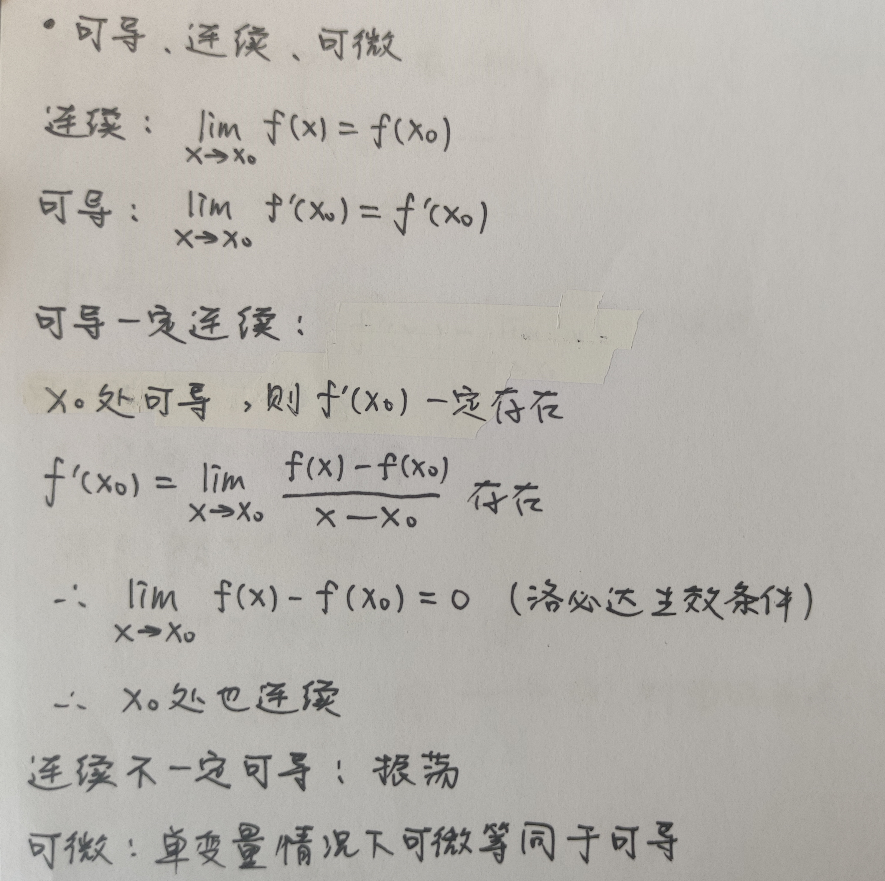

## 计算与证明

### f(x)在x=0处n阶导

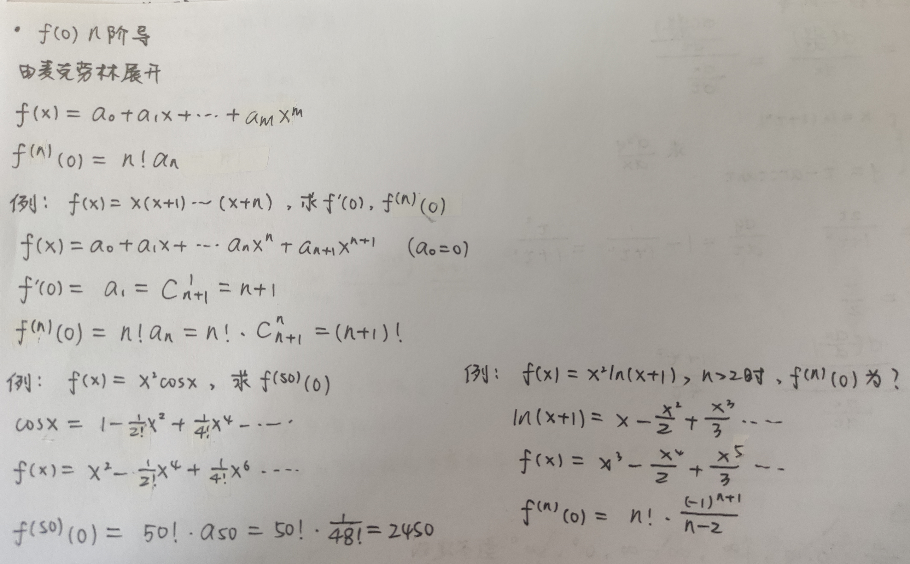

### 隐函数二阶导

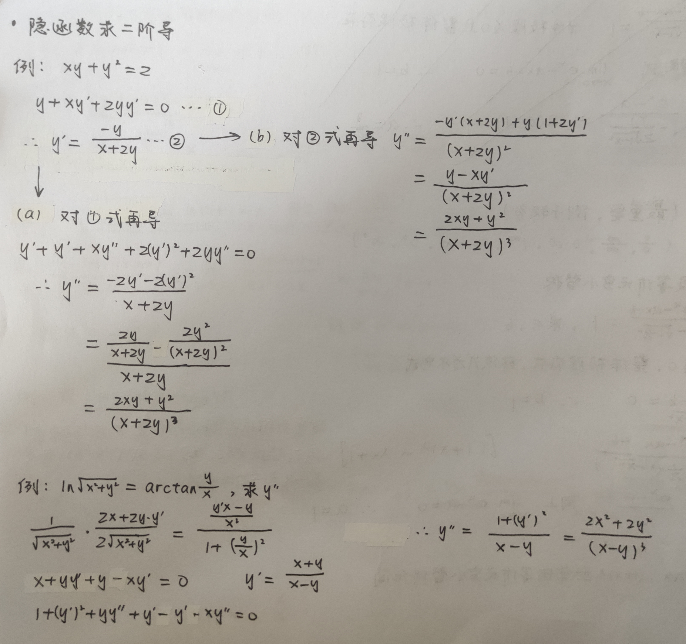

### 参数方程二阶导

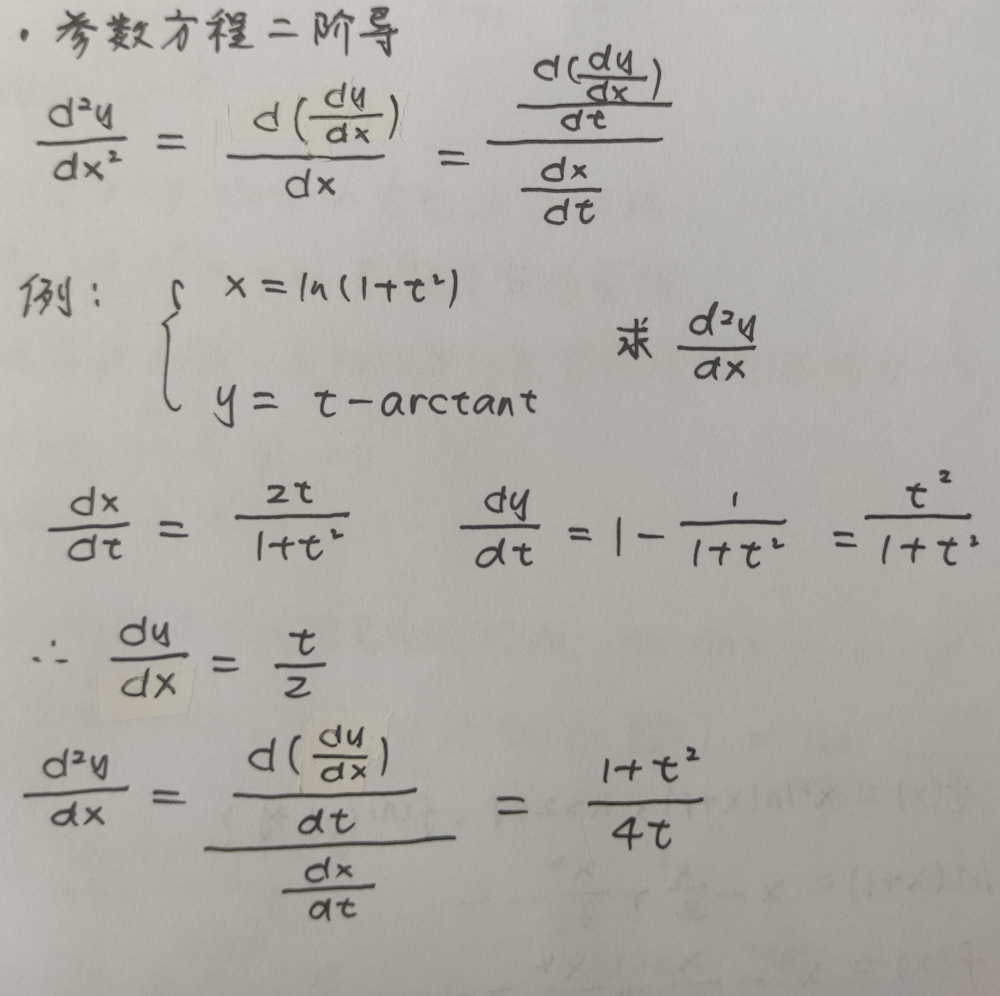

### 洛必达

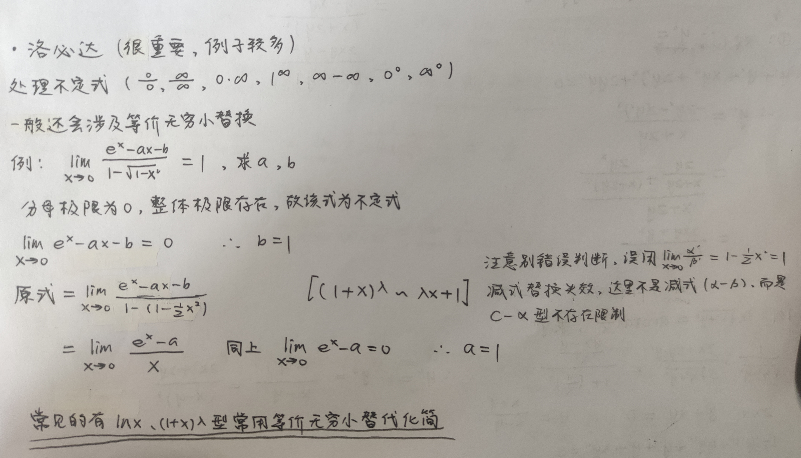

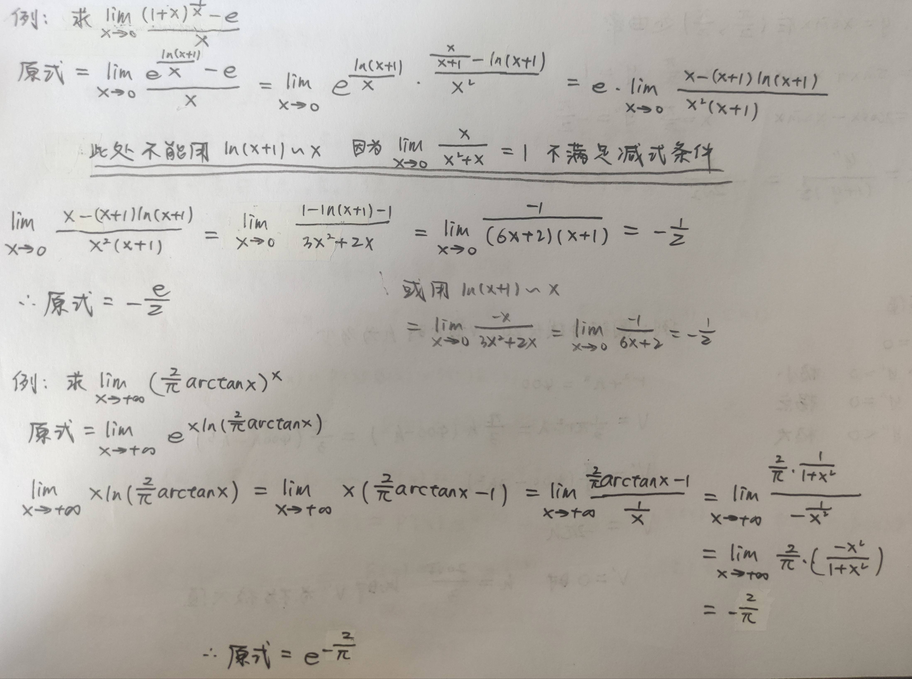

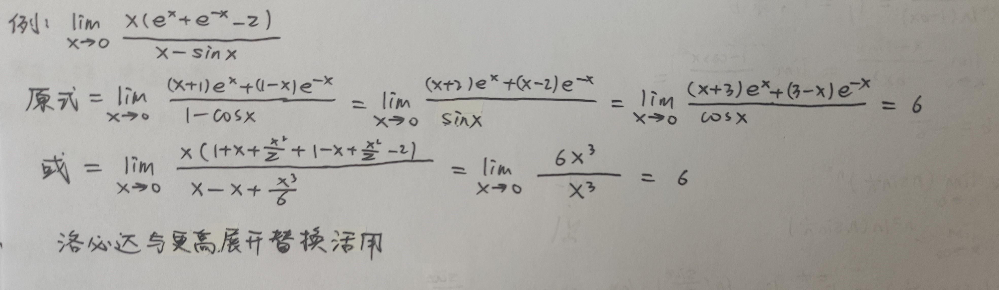

### 渐近线

.jpg)

### 曲率

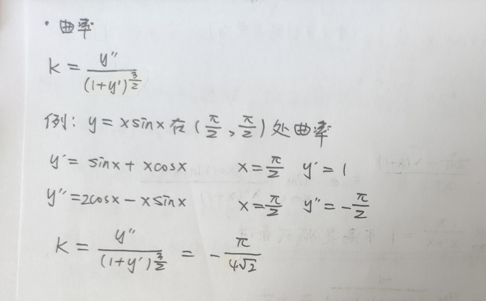

### 极值

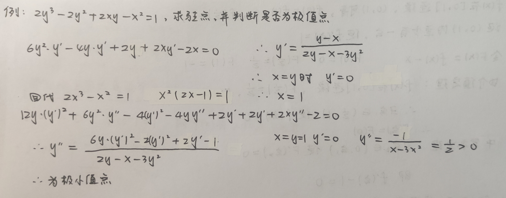

### 罗尔定理，中值定理

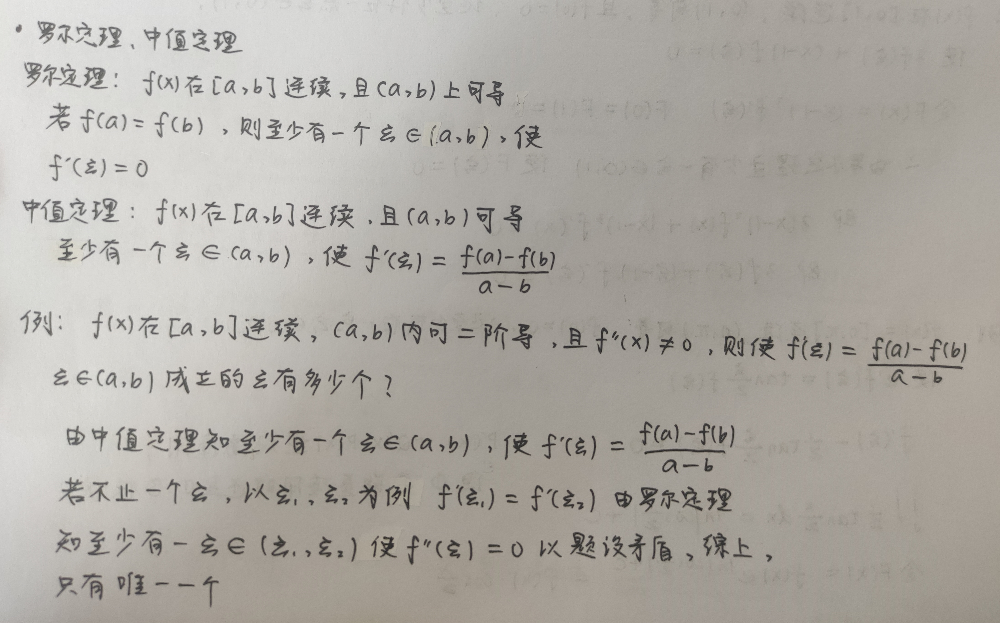

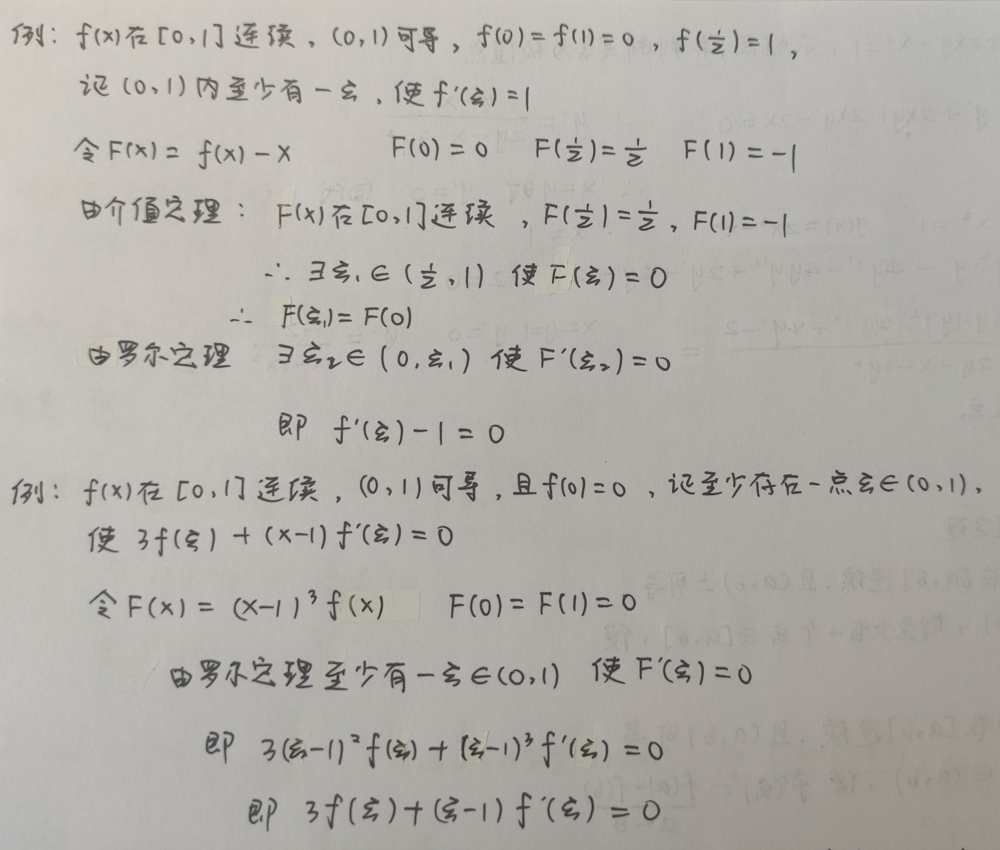

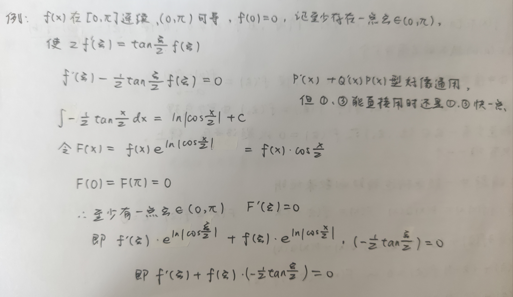

## 其他

### 易错:分段函数求导

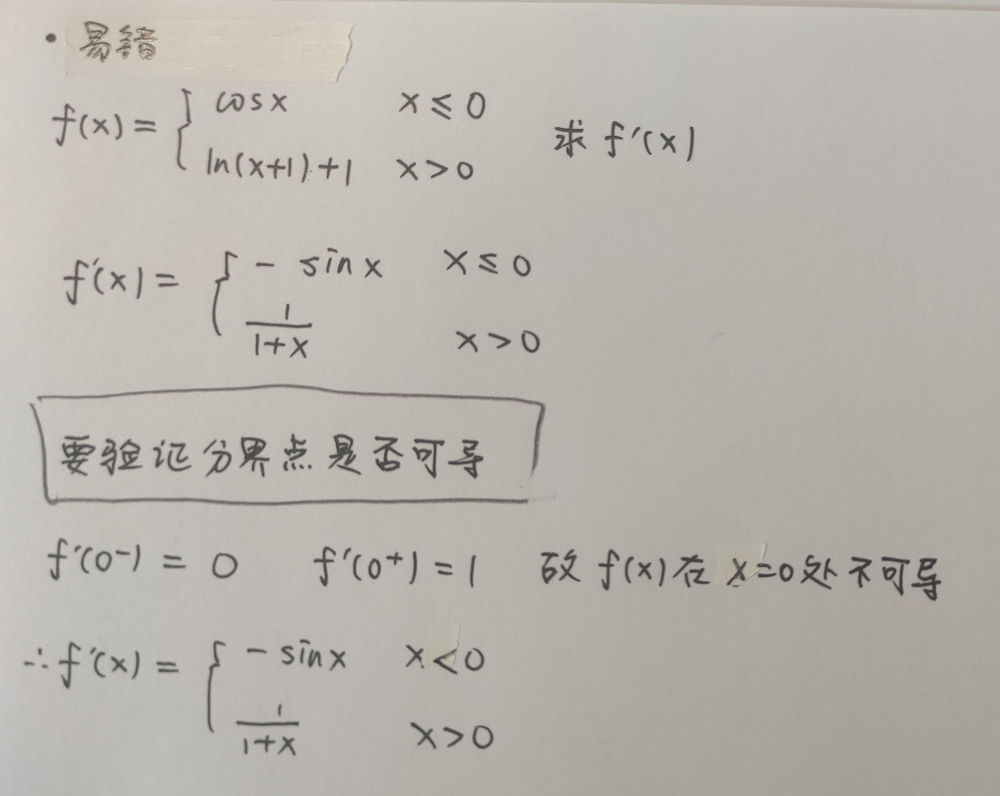

### 洛必达与导数定义

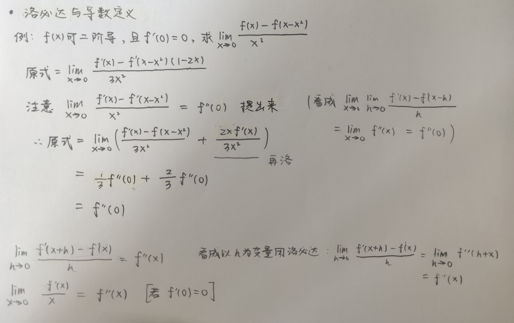