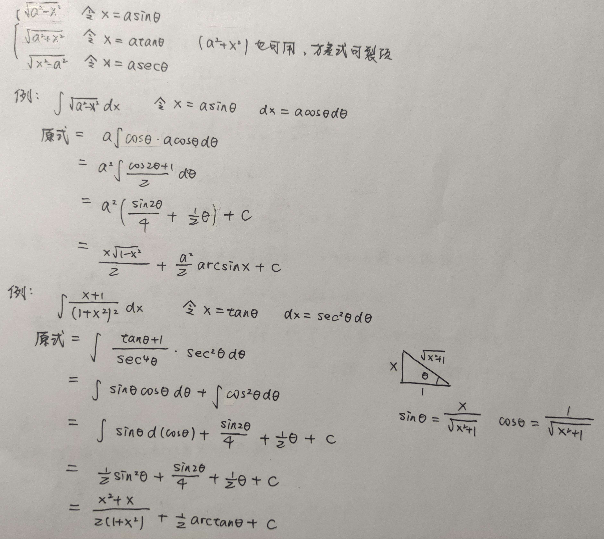

# 213积分

## 定义类

### 连续，可导与可积

###  f(x)连续性与原函数连续性

.jpg)

## 不定积分

### 基本不定积分表

### 三角换元

### 根式换元

### 倒代换

### 复杂代换

### 欧拉代换

### 分部积分

### 特殊形式

* 抵消型

  

* 找g'(x)/g(x)，尤其是在分式内

  

## 三角积分总结

### sin^m^xcos^n^x积分

### tan^m^xsec^n^x积分

### 万能三角代换

### 1/(a^2^sin^2^x+b^2^cos^2^x)积分

### (asinx+bcosx)/(csinx+dcosx)积分

### sinmxcosnx,sinmxsinnx,cosmxcosnx积分

### 降次

## 有理分式积分总结

### 多项式除法

### 拆分

### 求系数

* 二次式处理

* 高阶系数处理

## 其他

### sin^m^x在(0,Π)的定积分

如何转换积分形式

华里士公式

区间再现

### f(X)中含f(x)定积分

### x变限积分里含x

通过区间再现消去x

### 利用变限积分证不等式

